# MedAppoint ER Diagram & Schema Diagram

Date: 2026-04-02

This document contains:
1. **ER Diagram** (database relationships)
2. **Schema / Module Diagram** (high‑level system flow)

---

## 1) ER Diagram (Mermaid)

```mermaid
erDiagram
  USERS {
    INT id PK
    INT role_id FK
    STRING name
    STRING email
    STRING phone
  }
  ROLES {
    INT id PK
    STRING name
  }
  PERMISSIONS {
    INT id PK
    STRING code
  }
  ROLE_PERMISSIONS {
    INT role_id FK
    INT permission_id FK
  }
  ORG_ROLES {
    INT id PK
    STRING org_type
    INT org_id
    INT created_by FK
  }
  ORG_ROLE_PERMISSIONS {
    INT org_role_id FK
    INT permission_id FK
  }
  ORG_USER_ROLES {
    INT user_id FK
    INT org_role_id FK
  }
  CLINICS {
    INT id PK
    INT owner_doctor_id FK
  }
  CLINIC_PHOTOS {
    INT id PK
    INT clinic_id FK
  }
  DOCTOR_PROFILES {
    INT id PK
    INT user_id FK
    INT clinic_id FK
    INT main_doctor_id FK
  }
  DOCTOR_SCHEDULES {
    INT id PK
    INT doctor_id FK
    INT clinic_id FK
  }
  DOCTOR_LEAVES {
    INT id PK
    INT doctor_id FK
  }
  PATIENT_PROFILES {
    INT id PK
    INT user_id FK
  }
  APPOINTMENTS {
    INT id PK
    INT patient_id FK
    INT doctor_id FK
    INT clinic_id FK
    INT session_id FK
  }
  PATIENT_VITALS {
    INT id PK
    INT appointment_id FK
    INT patient_id FK
  }
  PRESCRIPTIONS {
    INT id PK
    INT appointment_id FK
    INT doctor_id FK
    INT patient_id FK
  }
  PRESCRIPTION_MEDICINES {
    INT id PK
    INT prescription_id FK
  }
  LABORATORY_PROFILES {
    INT id PK
    INT user_id FK
  }
  LAB_DEPARTMENTS {
    INT id PK
    INT lab_id FK
  }
  LAB_STAFF_DEPARTMENTS {
    INT id PK
    INT staff_user_id FK
    INT lab_id FK
    INT department_id FK
  }
  LAB_TESTS {
    INT id PK
    INT laboratory_id FK
    INT lab_department_id FK
  }
  LAB_TEST_PACKAGES {
    INT id PK
    INT laboratory_id FK
  }
  LAB_PACKAGE_TESTS {
    INT package_id FK
    INT test_id FK
  }
  LAB_ORDERS {
    INT id PK
    INT appointment_id FK
    INT doctor_id FK
    INT patient_id FK
  }
  LAB_ORDER_TESTS {
    INT lab_order_id FK
    INT test_id FK
  }
  LAB_REPORTS {
    INT id PK
    INT lab_order_id FK
    INT uploaded_by FK
  }
  LAB_REPORT_RESULTS {
    INT id PK
    INT lab_report_id FK
    INT test_id FK
  }
  LAB_PHOTOS {
    INT id PK
    INT lab_id FK
  }
  PHARMACIST_PROFILES {
    INT id PK
    INT user_id FK
  }
  MEDICINES {
    INT id PK
    INT pharmacist_id FK
  }
  MEDICINE_STOCK {
    INT id PK
    INT medicine_id FK
  }
  STOCK_MOVEMENTS {
    INT id PK
    INT medicine_id FK
    INT created_by FK
  }
  PHARMACY_PHOTOS {
    INT id PK
    INT pharmacist_id FK
  }
  RECEPTIONIST_PROFILES {
    INT id PK
    INT user_id FK
    INT clinic_id FK
    INT doctor_id FK
  }
  NOTIFICATIONS {
    INT id PK
    INT user_id FK
  }
  SYSTEM_ANNOUNCEMENTS {
    INT id PK
    INT created_by FK
  }
  INSURANCE_POLICIES {
    INT id PK
    INT patient_id FK
  }
  SHIFT_HANDOVER_NOTES {
    INT id PK
    INT clinic_id FK
    INT created_by FK
  }
  AUDIT_LOGS {
    INT id PK
    INT user_id FK
  }
  BLOG_POSTS {
    INT id PK
    INT author_id FK
  }
  MEDICAL_DEPARTMENTS {
    INT id PK
    STRING name
  }
  DOCTOR_DEPARTMENTS {
    INT doctor_id FK
    INT department_id FK
  }
  PAYMENT_ORDERS {
    INT id PK
    INT user_id FK
    INT role_id FK
  }

  ROLES ||--o{ USERS : assigns
  ROLES ||--o{ ROLE_PERMISSIONS : grants
  PERMISSIONS ||--o{ ROLE_PERMISSIONS : includes

  USERS ||--o{ ORG_ROLES : creates
  ORG_ROLES ||--o{ ORG_ROLE_PERMISSIONS : grants
  PERMISSIONS ||--o{ ORG_ROLE_PERMISSIONS : includes
  USERS ||--o{ ORG_USER_ROLES : assigned
  ORG_ROLES ||--o{ ORG_USER_ROLES : to_users

  USERS ||--o{ CLINICS : owns
  CLINICS ||--o{ CLINIC_PHOTOS : has

  USERS ||--|| DOCTOR_PROFILES : has
  USERS ||--|| PATIENT_PROFILES : has
  USERS ||--|| LABORATORY_PROFILES : has
  USERS ||--|| PHARMACIST_PROFILES : has
  USERS ||--o{ RECEPTIONIST_PROFILES : has

  CLINICS ||--o{ DOCTOR_SCHEDULES : schedules
  USERS ||--o{ DOCTOR_SCHEDULES : doctor
  USERS ||--o{ DOCTOR_LEAVES : leave

  USERS ||--o{ APPOINTMENTS : doctor
  USERS ||--o{ APPOINTMENTS : patient
  CLINICS ||--o{ APPOINTMENTS : clinic

  APPOINTMENTS ||--o{ PATIENT_VITALS : vitals
  APPOINTMENTS ||--o{ PRESCRIPTIONS : prescriptions
  PRESCRIPTIONS ||--o{ PRESCRIPTION_MEDICINES : medicines

  LABORATORY_PROFILES ||--o{ LAB_DEPARTMENTS : has
  LAB_DEPARTMENTS ||--o{ LAB_TESTS : categorizes
  LABORATORY_PROFILES ||--o{ LAB_TESTS : provides
  LAB_TEST_PACKAGES ||--o{ LAB_PACKAGE_TESTS : includes
  LAB_TESTS ||--o{ LAB_PACKAGE_TESTS : included

  APPOINTMENTS ||--o{ LAB_ORDERS : has
  LAB_ORDERS ||--o{ LAB_ORDER_TESTS : tests
  LAB_ORDERS ||--o{ LAB_REPORTS : reports
  LAB_REPORTS ||--o{ LAB_REPORT_RESULTS : results
  LABORATORY_PROFILES ||--o{ LAB_PHOTOS : photos
  USERS ||--o{ LAB_STAFF_DEPARTMENTS : staff_map
  LAB_DEPARTMENTS ||--o{ LAB_STAFF_DEPARTMENTS : dept_map

  PHARMACIST_PROFILES ||--o{ MEDICINES : manages
  MEDICINES ||--|| MEDICINE_STOCK : stock
  MEDICINES ||--o{ STOCK_MOVEMENTS : movements
  PHARMACIST_PROFILES ||--o{ PHARMACY_PHOTOS : photos

  USERS ||--o{ NOTIFICATIONS : receives
  USERS ||--o{ SYSTEM_ANNOUNCEMENTS : posts
  USERS ||--o{ INSURANCE_POLICIES : owns
  CLINICS ||--o{ SHIFT_HANDOVER_NOTES : handover
  USERS ||--o{ SHIFT_HANDOVER_NOTES : created_by
  USERS ||--o{ AUDIT_LOGS : audit
  USERS ||--o{ BLOG_POSTS : writes
  MEDICAL_DEPARTMENTS ||--o{ DOCTOR_DEPARTMENTS : dept
  USERS ||--o{ DOCTOR_DEPARTMENTS : doctor
  USERS ||--o{ PAYMENT_ORDERS : payments
  ROLES ||--o{ PAYMENT_ORDERS : role
```



---

## 2) Schema / Module Diagram (Mermaid)

```mermaid
flowchart TB
  subgraph Users
    PAT[Patient]
    DOC[Doctor]
    LAB[Lab]
    PHARM[Pharmacy]
    REC[Receptionist]
    ADM[Admin]
  end

  subgraph Core Services
    AUTH[Auth + OTP]
    APPT[Appointments + Queue + QR]
    LABMOD[Lab Orders + Reports]
    RX[Prescriptions]
    PAY[Payments + Booking Fee]
    BLOG[Blog/CMS]
    AI[AI Symptom Assist]
    NOTIF[Notifications]
  end

  subgraph Data Layer (MySQL)
    USERS_T[(users)]
    CLINICS_T[(clinics)]
    APPT_T[(appointments)]
    LAB_T[(lab_* tables)]
    RX_T[(prescriptions)]
    PAY_T[(payment_orders)]
    BLOG_T[(blog_posts)]
  end

  PAT --> AUTH --> USERS_T
  DOC --> AUTH --> USERS_T
  LAB --> AUTH --> USERS_T
  PHARM --> AUTH --> USERS_T
  REC --> AUTH --> USERS_T
  ADM --> AUTH --> USERS_T

  PAT --> APPT --> APPT_T
  DOC --> APPT --> APPT_T
  REC --> APPT --> APPT_T

  DOC --> RX --> RX_T
  PAT --> RX --> RX_T

  DOC --> LABMOD --> LAB_T
  LAB --> LABMOD --> LAB_T
  PAT --> LABMOD --> LAB_T

  PAT --> PAY --> PAY_T
  ADM --> PAY --> PAY_T

  DOC --> BLOG --> BLOG_T
  ADM --> BLOG --> BLOG_T

  PAT --> NOTIF
  DOC --> NOTIF
  LAB --> NOTIF
  PHARM --> NOTIF
  REC --> NOTIF
  ADM --> NOTIF
```

---

If you want this exported as **PNG/SVG** or embedded into your main documentation, tell me and I’ll generate it.  
