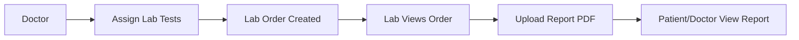
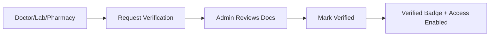

# MedAppoint Project Documentation 

Project: MedAppoint – Clinic Management Platform

---

## 1) Quotation Scope vs Current Implementation

### A. Scope Items **Completed / Implemented**
1. **Multi-Clinic & Multi-City System**
   - Clinic onboarding
   - City/state/location fields
   - Near-me search (GPS support in web)
2. **Patient Module (Advanced)**
   - OTP login (Firebase/Twilio fallback)
   - Profile, vitals, appointments, lab reports
   - Notifications
3. **Doctor & Receptionist Module**
   - Doctor profiles, schedules, leaves
   - Receptionist queue, walk-in
   - Prescriptions & vitals
4. **Appointment & Queue Management**
   - Session-based booking
   - Queue / token
   - QR check-in
   - Lifecycle tracking (pending → checked-in → completed)
5. **Multi-Lab Module**
   - Lab onboarding
   - Test assignment from doctor
   - Report upload + patient/doctor access
6. **Video Consultation**
   - Zoom meeting creation flow
   - Waiting-room handling
7. **Blog / CMS**
   - Doctor articles
   - Admin review/publish
8. **AI Chat Doctor Suggest Assistant**
   - Symptom input → recommended specialty
9. **Admin & Analytics Dashboard**
   - Admin approvals + full user/clinic detail view
   - User registry & clinic directory
10. **Frontend Web (React)**
    - Admin, doctor, lab, patient, receptionist portals
11. **Mobile App**
    - Flutter app with doctor/patient flows (Android + iOS build)
12. **Notifications**
    - In-app notifications + socket updates

### B. **Partially Implemented / Needs Extension**
1. **Billing & Invoice System**
   - Booking fee + payment status added
   - Invoice generation & PDF invoices: **not implemented**
2. **Role & Permission Management**
   - Global roles + org roles implemented
   - Fine-grained staff permissions UI: **partially done**
3. **Multi-language Support**
   - i18n setup exists
   - Full translation coverage incomplete
4. **Testimonials & Reviews**
   - Landing UI pieces exist
   - Full CRUD + moderation still partial

### C. **Missing / Not Implemented (from Quotation)**
1. **Billing features**
   - Discounts / coupons
   - Invoice PDFs
2. **Full QA & Testing**
   - No formal test suite delivered
3. **DevOps (CI/CD, infra)**
   - Not fully automated

### D. **Extra Work Done (Beyond Quotation)**
1. **Multi-Tenant experiments** (master + tenant DB version)
2. **Flutter iOS support** (quotation only specified Android)
3. **Payment gateways added**
   - Paytm + Razorpay + Stripe integrations (quotation said Phase 2)
4. **Staff Roles (Org-level RBAC)**
   - Clinic/Lab/Pharmacy staff roles
5. **Shift handover notes**
6. **Lab departments + per-dept staff**
7. **QR-based check-in**
8. **Clinic/Lab/Pharmacy photo galleries**

---

## 2) Modules (Current System)

### Admin
1. Dashboard & analytics  
2. Verification requests  
3. User registry (view/verify/disable)  
4. Clinic directory (view/verify)  
5. Plans & booking fee  
6. Announcements  
7. Audit logs  
8. Blog review  
9. Contact messages  

### Doctor
1. Profile & verification request  
2. Session schedule + leave management  
3. Appointment queue & QR check-in  
4. Vitals + prescription creation  
5. Lab order assignment  
6. Guest doctors  
7. Clinic management  
8. Articles/blog posts  

### Patient
1. OTP registration/login  
2. Book appointment  
3. View appointments + queue  
4. QR for check-in  
5. Prescriptions  
6. Lab orders + reports  
7. Profile + insurance/KYC  

### Laboratory
1. Profile + verification request  
2. Test management  
3. Lab orders + test status  
4. Report upload (PDF)  
5. Lab departments  

### Pharmacy
1. Profile + verification request  
2. Medicines + stock  
3. Low-stock alerts  
4. Prescription dispense  

### Receptionist
1. Walk-in registration  
2. Queue management  
3. QR check-in  
4. Shift handover notes  

---

## 3) API Endpoints (Current)

### Auth
- `POST /api/auth/send-otp`
- `POST /api/auth/verify-otp`
- `POST /api/auth/register`
- `POST /api/auth/login`
- `POST /api/auth/login-otp`
- `POST /api/auth/refresh`
- `GET /api/auth/me`
- `POST /api/auth/change-password`

### Admin
- `GET /api/admin/dashboard`
- `GET /api/admin/users`
- `GET /api/admin/users/:id`
- `PATCH /api/admin/users/:id/verify`
- `PATCH /api/admin/users/:id/toggle-status`
- `GET /api/admin/clinics`
- `GET /api/admin/clinics/:id`
- `PATCH /api/admin/clinics/:id/verify`
- `GET /api/admin/pending-verifications`
- `GET /api/admin/audit-logs`
- `GET /api/admin/reports`
- `GET /api/admin/contact-messages`
- `PATCH /api/admin/contact-messages/:id/reply`
- `GET /api/admin/plans`
- `POST /api/admin/plans`
- `PUT /api/admin/plans/:id`
- `GET /api/admin/booking-fee`
- `POST /api/admin/booking-fee`
- `GET /api/admin/announcements`
- `POST /api/admin/announcements`
- `GET /api/admin/departments`
- `POST /api/admin/departments`

### Appointments
- `GET /api/appointments/booking-fee`
- `GET /api/appointments/slots`
- `POST /api/appointments/book`
- `POST /api/appointments/walk-in`
- `GET /api/appointments`
- `GET /api/appointments/queue`
- `GET /api/appointments/:id/qr`
- `POST /api/appointments/qr/checkin`
- `PATCH /api/appointments/:id/status`
- `POST /api/appointments/:id/requeue`
- `POST /api/appointments/:id/vitals`

### Clinic
- `GET /api/clinics/search`
- `POST /api/clinics`
- `PUT /api/clinics/:id`
- `GET /api/clinics/my-clinics`
- `POST /api/clinics/:id/photos`
- `POST /api/clinics/:id/request-verification`
- `GET /api/clinics/:id/receptionists`
- `POST /api/clinics/add-receptionist`
- `GET /api/clinics/:id/roles`
- `POST /api/clinics/:id/roles`
- `PUT /api/clinics/:id/roles/:roleId/permissions`
- `POST /api/clinics/:id/roles/:roleId/assign`

### Doctor
- `GET /api/doctors/search`
- `GET /api/doctors/profile`
- `GET /api/doctors/:id/profile`
- `POST /api/doctors/setup-profile`
- `POST /api/doctors/request-verification`
- `GET /api/doctors/schedule`
- `POST /api/doctors/schedule`
- `GET /api/doctors/leaves`
- `POST /api/doctors/leave`
- `GET /api/doctors/dashboard-stats`
- `POST /api/doctors/add-guest-doctor`
- `GET /api/doctors/guest-doctors`
- `GET /api/doctors/patient/:patientId`

### Patient
- `GET /api/patient/profile`
- `PUT /api/patient/profile`
- `GET /api/patient/insurance`
- `POST /api/patient/insurance`
- `GET /api/patient/search`
- `GET /api/patient/summary`

### Laboratory
- `GET /api/lab/search`
- `GET /api/lab/profile`
- `GET /api/lab/:id/profile`
- `POST /api/lab/setup-profile`
- `POST /api/lab/request-verification`
- `POST /api/lab/photos`
- `GET /api/lab/departments`
- `POST /api/lab/departments`
- `GET /api/lab/tests`
- `POST /api/lab/tests`
- `PUT /api/lab/tests/:id`
- `POST /api/lab/orders/assign`
- `GET /api/lab/orders`
- `PATCH /api/lab/orders/:id/status`
- `PATCH /api/lab/orders/:id/tests`
- `GET /api/lab/reports`
- `POST /api/lab/reports/upload`
- `GET /api/lab/reports/:id/view`

### Pharmacy
- `GET /api/pharmacist/search`
- `GET /api/pharmacist/profile`
- `POST /api/pharmacist/setup-profile`
- `POST /api/pharmacist/request-verification`
- `POST /api/pharmacist/photos`
- `POST /api/pharmacist/staff`
- `GET /api/pharmacist/dashboard`
- `GET /api/pharmacist/medicines`
- `POST /api/pharmacist/medicines`
- `POST /api/pharmacist/stock/update`
- `GET /api/pharmacist/stock/alerts`
- `GET /api/pharmacist/medicines/search`

### Prescriptions
- `POST /api/prescriptions`
- `GET /api/prescriptions`
- `GET /api/prescriptions/:id`
- `PATCH /api/prescriptions/:id/dispense`

### Blog/CMS
- `GET /api/blogs`
- `GET /api/blogs/slug/:slug`
- `POST /api/blogs`
- `GET /api/blogs/mine`
- `GET /api/blogs/pending`
- `PATCH /api/blogs/:id/status`

### AI Assistant
- `POST /api/ai/assist`

### Notifications
- `GET /api/notifications`
- `PATCH /api/notifications/read-all`
- `PATCH /api/notifications/:id/read`

### Payments
- `POST /api/payments/paytm/initiate`
- `POST /api/payments/paytm/callback`
- `GET /api/payments/paytm/status`
- `POST /api/payments/razorpay/initiate`
- `POST /api/payments/razorpay/webhook`
- `GET /api/payments/razorpay/status`
- `POST /api/payments/stripe/initiate`
- `POST /api/payments/stripe/webhook`
- `GET /api/payments/stripe/status`

---

## 4) Flow Charts

### A. Appointment Booking + Queue + QR Check-in

```mermaid
flowchart LR
  Patient[Patient] -->|Search & Select Doctor| Booking[Book Appointment]
  Booking --> Payment[Pay Booking Fee]
  Payment --> Appt[Appointment Created]
  Appt --> QR[Generate QR]
  QR --> Scan[Reception/Doctor Scans QR]
  Scan --> CheckIn[Status = checked_in]
  CheckIn --> Queue[Queue Progress]
  Queue --> Consultation[Consultation]
  Consultation --> Complete[Status = completed]
```

### B. Lab Orders & Reports

### C. Verification Flow

---

## 5) Current Gaps
1. Full **invoice generation + PDF export** not built  
2. Coupon/discount system missing  
3. Formal QA testing report missing  
4. CI/CD pipeline not configured  
5. Multi-language translation coverage incomplete  

---

## 6) Summary for Meeting
- **Major core modules** from quotation are implemented.  
- **Extra features** (multi‑tenant attempt, iOS support, multiple payment gateways) were added beyond scope.  
- **Remaining work** is mostly in billing (invoice, coupons), QA/testing, and infra automation.  

---

If you want, I can also export this document to PDF and a separate “Meeting Slides” summary page.  
